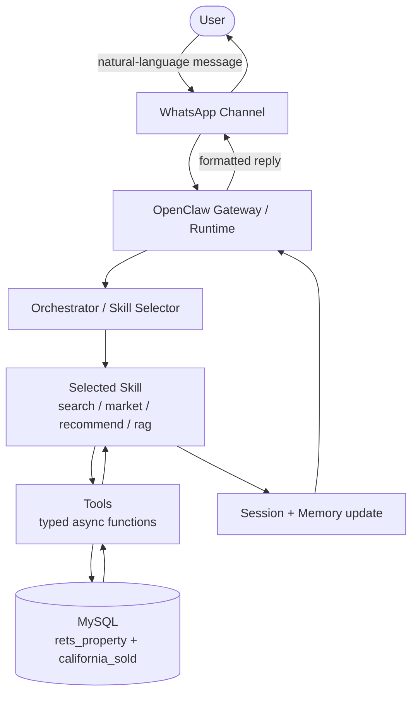

# IDX Multi-Agent Assistant — Architecture (Week 1)

## 1. Overview

This project is a production-grade, multi-agent real-estate AI assistant built on
the **OpenClaw** runtime. Users chat with it in natural language over WhatsApp
("show me 3-bedroom condos in Irvine under $1.5M with a pool") and it answers by
querying two real MLS datasets, running market analytics, recommending comparable
homes, retrieving knowledge, and drafting emails. The goal is to turn free-text
questions into grounded, data-backed answers over structured MLS data — safely,
with human-in-the-loop approval for any outbound action.

## 2. Core Components

- **Gateway (Runtime):** The always-on background service (a LaunchAgent on this
  machine, reachable at `ws://127.0.0.1:18789`). It is the hub: it receives inbound
  messages from channels, routes them to skills, runs tools, manages sessions, and
  sends replies back. Everything else plugs into the Gateway.
- **Channels:** The communication interfaces between a user and the agent
  (WhatsApp, Telegram, email, web). They are the "doors" messages enter and leave
  through. This project's primary channel is **WhatsApp**.
- **Skills:** Modular capability units. Each solves one class of request:
  `propertySearch`, `marketStats`, `recommendation`, `rag`, `emailDraft`. A skill
  is *what* the agent can do.
- **Tools:** The typed, async functions a skill actually calls to get work done
  (e.g. `searchActiveListings()`, `getSoldComps()`). A tool is *how* a skill does
  its job — usually a concrete step like running a parameterized SQL query.
- **Sessions:** Per-user conversation state, keyed by user ID. Lets the agent
  remember context across turns ("budget is $1.2M", "prefers single-family").
- **Memory:** Short-term session state (the current conversation) plus long-term
  storage — including a vector store of listing embeddings used for semantic search
  (Week 6+).
- **Orchestrator:** The router. It classifies each incoming query (search / market
  / recommend / knowledge / mixed) and dispatches it to the right skill, or fans it
  out across several skills and merges the results (Week 9).

## 3. Data Layer

Both tables live in the same MySQL schema (`idx_exchange`).

- **rets_property** — active MLS listings; the live search/discovery table.
  ~53K rows in our working subset. Key columns: `L_City`, `L_SystemPrice`,
  `L_Keyword2` (beds), `LM_Dec_3` (baths), `L_Type_`, `PoolPrivateYN`, `ViewYN`,
  `L_Remarks` (FULLTEXT indexed, used for embeddings).
- **california_sold** — sold/closed transactions; the historical comps and
  analytics table. ~87K rows. Key columns: `ClosePrice`, `CloseDate`,
  `DaysOnMarket`, `LivingArea`, `City`, `PropertyType`.

The two tables join on `rets_property.L_ListingID = california_sold.ListingKey`
(or match on city + postal code for market-level analysis).

## 4. Request Flow

**Walkthrough:**

1. A user sends a free-text message via WhatsApp.
2. The **Channel** hands it to the **Gateway**.
3. The **Orchestrator** classifies the intent and picks the right **Skill**.
4. The skill calls one or more **Tools**, which run parameterized SQL against the
   two **MLS tables**.
5. Results flow back up; the **Session/Memory** is updated with new context.
6. The Gateway formats a reply and sends it back out through the Channel to the user.

