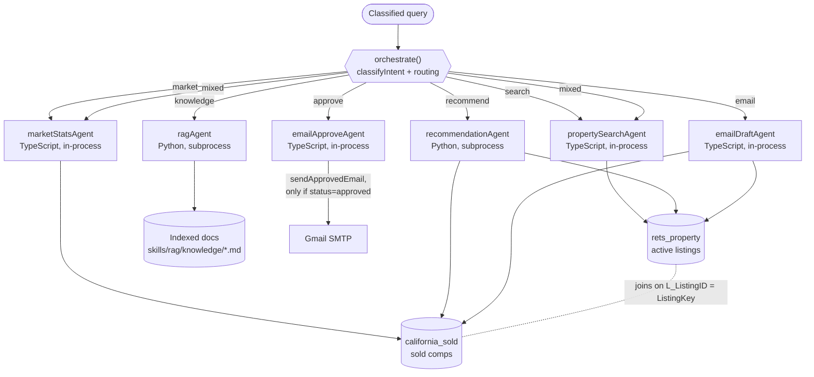
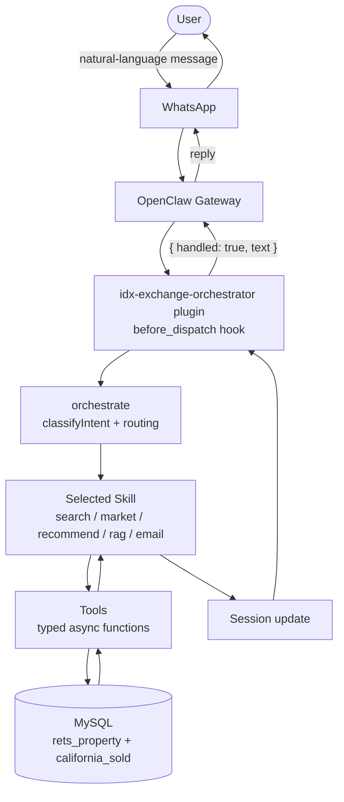

# IDX Multi-Agent Assistant — Architecture

*Living document, kept in sync with the actual code through Week 11. Started
as a Week 1 design sketch; several pieces below (the real WhatsApp plugin,
the email approval loop, cross-process session persistence) didn't exist
yet at that point and were added as the project grew.*

## 1. Overview

This project is a multi-agent real-estate AI assistant built on the
**OpenClaw** runtime. Users chat with it in natural language over a real,
live-connected WhatsApp number ("show me 3-bedroom condos in Irvine under
$1.5M with a pool") and it answers by querying two real MLS datasets,
running market analytics, recommending comparable homes, retrieving
grounded knowledge, and drafting emails. The goal is to turn free-text
questions into grounded, data-backed answers over structured MLS data —
safely, with human-in-the-loop approval for any outbound action (email
sending; nothing else in this project sends anything on its own).

## 2. Core Components

- **Gateway (Runtime):** OpenClaw's always-on background service (a
  LaunchAgent on this machine, reachable at `ws://127.0.0.1:18789`). It
  receives inbound channel messages, loads plugins, and runs OpenClaw's own
  default agent — unless a plugin's `before_dispatch` hook claims the
  message first (see §6).
- **Channels:** WhatsApp (real, connected) and email (outbound only, gated
  behind approval). WhatsApp is wired in via a custom OpenClaw plugin, not
  OpenClaw's own built-in conversational agent — see §6.
- **Skills:** Modular capability units, one per class of request:

  | Skill | What it does |
  |---|---|
  | `property-search` | NL query -> structured filters, multi-turn session memory |
  | `market-stats` | Aggregated trends, comps, and pricing analytics |
  | `semantic-search` | Embedding-based similarity search over listing remarks |
  | `recommendation` | Similar listings + comp-validated pricing |
  | `rag` | Grounded conceptual/definitional answers from indexed docs |
  | `orchestrator` | Intent classification + routing across every other skill |
  | `whatsapp` | The message handler + the real OpenClaw plugin (§6) |
  | `email` | Draft-then-approve email workflows (§6) |

- **Tools:** The typed, async functions a skill actually calls to get work
  done (e.g. `searchActiveListings()`, `getSoldComps()`, `draftEmail()`). A
  tool is *how* a skill does its job — usually a parameterized SQL query or
  a subprocess call into a Python skill.
- **Sessions:** Per-user conversation state, keyed by user ID
  (`property-search/session.ts`). Holds accumulated search filters, the
  most recent search results (so "show me more like this" has something to
  point at), and any email draft awaiting an "approve" reply. In-memory by
  default; see §6 for why the real WhatsApp path additionally persists it
  to a file.
- **Memory:** Two different things, easy to conflate:
  1. Session memory above (per-user, short-lived, in-process).
  2. A JSON cache of OpenAI embeddings for 500 listings
     (`semantic-search/index_cache.json`), searched with brute-force cosine
     similarity in Python — not a managed vector database (no
     Pinecone/FAISS/pgvector). Accurate enough at this scale; called out
     explicitly here because "vector store" oversells it.
- **Orchestrator:** The router. `classifyIntent()` is a deterministic
  regex classifier (no LLM call per routing decision) returning one of
  `search | market | recommend | knowledge | email | approve | mixed |
  unknown`. `orchestrate()` dispatches to one skill, or fans `search` +
  `market` out in parallel via `Promise.all` for a `mixed` query.

## 3. Data Layer

Both tables live in the same MySQL schema (`idx_exchange`).

- **rets_property** — active MLS listings; the live search/discovery table.
  53,122 rows in the working local dataset (verified against the live DB,
  not an estimate). Key columns: `L_City`, `L_SystemPrice`, `L_Keyword2`
  (beds), `LM_Dec_3` (baths), `LM_Int2_3` (sqft), `L_Type_`,
  `PoolPrivateYN`, `ViewYN`, `ListingContractDate`, `L_Remarks` (used for
  embeddings).
- **california_sold** — sold/closed transactions; the historical comps and
  analytics table. 87,157 rows. Key columns: `ClosePrice`, `CloseDate`,
  `DaysOnMarket`, `LivingArea`, `City`, `PropertyType`.

The two tables join on `rets_property.L_ListingID = california_sold.ListingKey`
(or match on city + postal code for market-level analysis). Every query
that can return more than a handful of rows is capped at 50
(`searchActiveListings`, `getSoldComps`, `getNewListings`) — a deliberate
"never bulk-export the dataset" guardrail, not an incidental default.

## 4. Multi-Agent Flow (every agent, both databases)

The diagram in §5 shows one message's round trip through the WhatsApp
transport layer. This one instead shows what `orchestrate()` actually fans
out to underneath that -- all six agents, and exactly which database (or
external system) each one touches, since "both tables" hides real
differences in how each agent uses them.


```mermaid
flowchart TD
    Q([Classified query]) --> ORC{{"orchestrate()<br/>classifyIntent + routing"}}

    ORC -->|search| PSA[propertySearchAgent<br/>TypeScript, in-process]
    ORC -->|market| MSA[marketStatsAgent<br/>TypeScript, in-process]
    ORC -->|recommend| RCA[recommendationAgent<br/>Python, subprocess]
    ORC -->|knowledge| RGA[ragAgent<br/>Python, subprocess]
    ORC -->|email| EDA[emailDraftAgent<br/>TypeScript, in-process]
    ORC -->|approve| EAA[emailApproveAgent<br/>TypeScript, in-process]
    ORC -->|mixed| PSA
    ORC -->|mixed| MSA

    PSA --> RP[(rets_property<br/>active listings)]
    MSA --> CS[(california_sold<br/>sold comps)]
    RCA --> RP
    RCA --> CS
    RGA --> KD[(Indexed docs<br/>skills/rag/knowledge/*.md)]
    EDA --> RP
    EDA --> CS
    EAA -->|sendApprovedEmail,<br/>only if status=approved| SMTP[Gmail SMTP]

    RP -. "joins on L_ListingID = ListingKey" .- CS
```

**Why this shape, not a simpler one:** `recommendationAgent` and
`emailDraftAgent` are the two places both tables genuinely meet in one
request -- a recommendation needs `rets_property` for the candidate
listings and `california_sold` for the comp check; an emailed market report
or property summary pulls from both the same way the equivalent chat reply
does. `ragAgent` is the odd one out: it never touches MySQL at all, it
retrieves from indexed markdown documents instead -- worth showing
explicitly, since "both tables" as a blanket description would misstate
what RAG actually does. `emailApproveAgent` is the only node in the whole
system with an edge to something outside this project's own data (Gmail),
which is exactly why it's the one path gated behind an explicit approval
status check rather than just being "another agent."

## 5. Request Flow (WhatsApp transport path)


```mermaid
flowchart TD
    U([User]) -->|"natural-language message"| CH[WhatsApp]
    CH --> GW[OpenClaw Gateway]
    GW --> PL[idx-exchange-orchestrator plugin<br/>before_dispatch hook]
    PL --> OR[orchestrate<br/>classifyIntent + routing]
    OR --> SK[Selected Skill<br/>search / market / recommend / rag / email]
    SK --> TL[Tools<br/>typed async functions]
    TL --> DB[(MySQL<br/>rets_property + california_sold)]
    DB --> TL
    TL --> SK
    SK --> MEM[Session update]
    MEM --> PL
    PL -->|"{ handled: true, text }"| GW
    GW -->|"reply"| CH
    CH --> U
```

**Walkthrough:**

1. A user sends a free-text WhatsApp message.
2. OpenClaw's Gateway receives it and, before running its own default
   agent, calls every plugin's `before_dispatch` hook.
3. The `idx-exchange-orchestrator` plugin claims it (if the channel is
   WhatsApp), spawns `pluginEntry.ts` as a subprocess, and awaits its reply.
4. `orchestrate()` classifies intent and calls one or more skills.
5. The skill's tools run parameterized SQL (or a Python subprocess call)
   against the MLS tables.
6. Results flow back up; the session is updated with new context.
7. The plugin returns `{ handled: true, text: reply }`, which fully
   replaces OpenClaw's default agent reply for that message.

## 6. The real WhatsApp integration (`skills/whatsapp/`)

This is the one piece that genuinely required reading OpenClaw's own
installed source, not just its docs, to get working — worth documenting in
some detail since it's not obvious from the code alone.

- **Two non-interoperating hook APIs exist in OpenClaw.**
  `api.registerHook(name, handler, opts)` writes into a legacy
  `registry.hooks` array driven by an old event-emitter path — it never
  throws, and even shows up in `openclaw plugins inspect --runtime`'s
  output, which makes it look correctly wired when it isn't. The live
  dispatch pipeline's `before_dispatch` check only ever reads
  `registry.typedHooks`, populated exclusively by `api.on(name, handler)`.
  The plugin (`skills/whatsapp/openclaw-plugin/index.js`) uses `api.on`.
- **The plugin is plain JavaScript, not TypeScript.** `openclaw plugins
  install` requires a compiled entry point for installed packages; it
  doesn't run `.ts` files through Node's native type stripping the way this
  project's own scripts do.
- **The plugin reaches this project by spawning `pluginEntry.ts` as a
  subprocess**, by absolute path (it's installed to
  `~/.openclaw/extensions/`, outside this repo, so it can't use a relative
  import). Same "spawn, parse one JSON line of stdout" pattern
  `orchestrator/pythonBridge.ts` uses to reach the Python skills.
- **Each WhatsApp message is a brand-new OS process**, not a long-lived
  server. Two consequences that shaped the code:
  - `property-search/db.ts`'s MySQL connection pool keeps a process alive
    indefinitely once a query has actually run on it, so `pluginEntry.ts`
    calls `process.exit(0)` right after printing its reply instead of
    relying on the process to exit naturally.
  - The in-memory session `Map` resets on every single message, so
    `pluginEntry.ts` also reads/writes `session-store.json`
    (`exportSessions()`/`importSessions()`) before and after each call —
    otherwise "show me more like this" would never see the search that
    just happened one message ago. `demo.ts`/`simulatedChannel.ts` don't
    need this, since they run as one long-lived process for a whole
    conversation.

## 7. Email workflow (`skills/email/`)

Three-step gate, matching the handbook's contract but with one real
enforcement added: `sendApprovedEmail()` checks `draft.status === "approved"`
itself and throws otherwise, rather than trusting the caller to only invoke
it after a human said yes.

```
draftEmail(to, subject, body)  -- never sends
        |
approveDraft(draft)             -- explicit human sign-off
        |
sendApprovedEmail(draft)        -- refuses anything not marked approved
```

Reached from chat via two orchestrator intents: `"email"` drafts one of
four templates (listing alert, market report, property summary,
recommendation digest — each built from the same skills the chat replies
already use, not re-queried) and stores it in
`session.pendingEmailDraft`; `"approve"` is the only path in this project
that calls `sendApprovedEmail`, and it refuses if there's no pending draft.
`skills/email/guardrails.test.ts` is the automated check for all of this —
it swaps the real transporter for a spy, so running the test suite can
never actually send an email.
